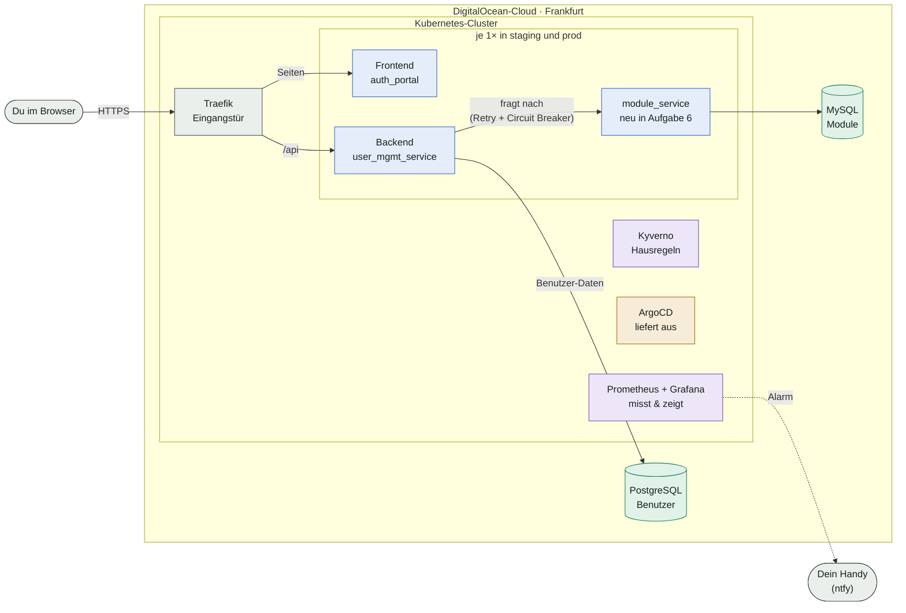
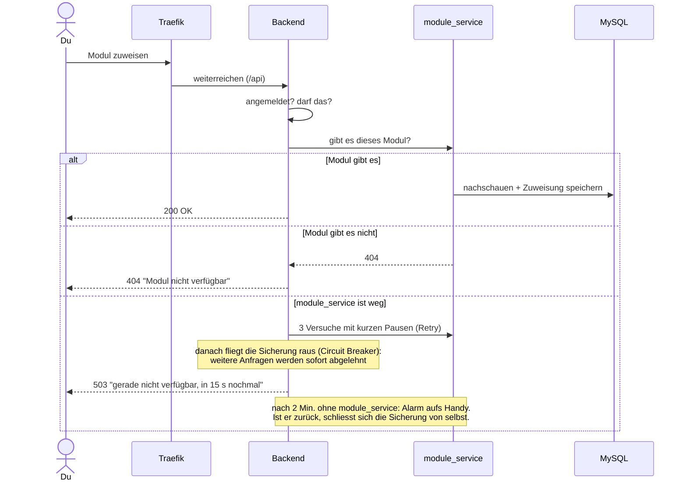
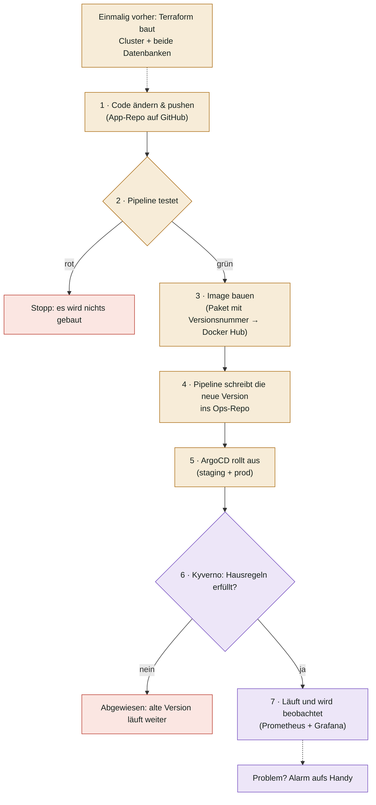

# Das ganze Projekt auf einer Seite

Einstieg ins TEKO-Projekt *Verteilte Systeme*, ohne technische Details. Eine kleine Web-App zur
Benutzerverwaltung läuft in der Cloud. Darum herum haben wir in sechs Aufgaben aufgebaut, was ein
echter Betrieb braucht: **messen, testen, automatisch ausliefern, absichern**.

Die Details stehen in den READMEs der einzelnen Ordner (siehe [Wo finde ich was](#wo-finde-ich-was)).

## Was läuft wo

Farben: **blau** = die Programme der App, **grün** = Daten, **orange** = Ausliefern, **lila** = Aufpassen.

Frontend, Backend und module_service laufen je einmal in **staging** (Testversion) und in **prod**
(die echte). Traefik, Monitoring, Kyverno und ArgoCD gibt es nur einmal für den ganzen Cluster.

| Baustein | Was er macht | Vergleich |
|---|---|---|
| **Traefik** | Eingangstür: Webseiten gehen ans Frontend, alles unter `/api` ans Backend | Rezeption eines Hotels |
| **Frontend** (`auth_portal`) | die Seiten, die man sieht (Login, Benutzerliste); hat selbst keine Daten | Schaufenster |
| **Backend** (`user_mgmt_service`) | Herz der App (Java): Login, Benutzer, Modul-Zuweisung; bei Last automatisch mehr Kopien | Sekretariat, das alles koordiniert |
| **module_service** | eigener kleiner Dienst (Python), der die Module kennt und wer welches hat | Kursbüro mit eigener Modulliste |
| **PostgreSQL** | Benutzer-Datenbank, von DigitalOcean betrieben, per Terraform angelegt | gemieteter Aktenschrank |
| **MySQL** | Modul-Datenbank, **nur** der module_service kommt hin (auch übers Netz nicht das Backend) | zweiter Schrank, nur das Kursbüro hat den Schlüssel |
| **Prometheus + Grafana** | sammeln Messwerte (Anfragen, Fehler, Antwortzeit, CPU) und zeigen Dashboards; Regeln lösen Alarme aus | Fieberthermometer + Kurvenblatt |
| **Kyverno** | lässt nur rein, was die Hausregeln erfüllt (Limits, feste Version, Gesundheitschecks, keine Sonderrechte) | Türsteher mit Checkliste |
| **ArgoCD** | gleicht den Cluster ständig mit dem Ops-Repo ab; wer etwas ändern will, ändert das Repo | Hauswart, der alles nach Plan hinstellt |

## Was passiert, wenn man ein Modul zuweist

Statuscodes: `200` OK · `400` Eingabe falsch · `403` nicht erlaubt · `404` gibt's nicht · `503` Dienst kurz weg

## Vom Code bis live

Niemand installiert von Hand. Eine Änderung löst eine Kette aus, und jeder Schritt hängt vom
vorherigen ab. Rot markiert ist, wo die Kette abbricht; dann geht nichts Kaputtes live.

- **App-Repos** (Code): `linosteiner/user_mgmt_service`, `linosteiner/auth_portal`, `linosteiner/module_service`
- **Ops-Repo** (Bauplan für den Betrieb): `bernetlennard/user_mgmt_ops`, dieses Repo

## Die sechs Aufgaben, je ein Satz

| # | Aufgabe | In einem Satz | Wo im Bild |
|---|---|---|---|
| 1 | **Observability** | Prometheus sammelt Messwerte, Grafana zeigt sie als Dashboards, Alarme gehen über ntfy aufs Handy. | Prometheus + Grafana |
| 2 | **Chaos Testing** | Mit k6 simulieren wir viele Nutzer; das Backend startet automatisch zusätzliche Kopien und bleibt erreichbar. | Backend |
| 3 | **Terraform Infrastructure as Code** | Statt in der DigitalOcean-Oberfläche zu klicken, beschreibt eine Textdatei, was existieren soll, und Terraform stellt es so her. | Cluster, Datenbanken |
| 4 | **Managed Ressources** | Die Datenbank läuft nicht mehr selbst im Cluster, sondern als fertiger Dienst von DigitalOcean. | PostgreSQL |
| 5 | **Kyverno Policy as Code** | Hausregeln für den Cluster: Wer sie bricht, wird schon beim Ausliefern abgewiesen. | Kyverno |
| 6 | **Microservices** (40 % der Note) | Neuer module_service mit eigener MySQL; das Backend fragt ihn übers Netz und ist gegen seinen Ausfall abgesichert. | module_service, MySQL |

## Wo finde ich was

| Thema | Ort | Wie es live geht |
|---|---|---|
| App im Cluster (Frontend, Backend, module_service, Netzwerkregeln, Alarme) | [`charts/user-mgmt/`](../charts/user-mgmt/) | automatisch über ArgoCD, sobald auf `main` |
| Monitoring (Prometheus, Grafana, Dashboards, Alarm → ntfy) | [`monitoring/`](../monitoring/) | von Hand mit `helm upgrade` |
| Lasttests (k6) und Resultate | [`k6/`](../k6/) | von Hand mit `kubectl apply` |
| Kyverno-Regeln | [`policy/`](../policy/) | Regeln über ArgoCD, Kyverno selbst von Hand |
| Cluster + Datenbanken (Terraform) | [`terraform/`](../terraform/) | von Hand mit `terraform apply` |
| ArgoCD-Anwendungen | [`argocd/`](../argocd/) | einmalig `kubectl apply` |
| Aufgabe 6 im Detail, mit allen Nachweisen | [`docs/module-service.md`](module-service.md) | – |

**Wichtig für die Zusammenarbeit:**

- Den Terraform-State (`terraform/terraform.tfstate`) gibt es nur als eine gültige Kopie, weil er
  nicht im Repo liegt. Nach jedem `terraform apply` muss er an die andere Person weitergegeben werden.
- Passwörter liegen nie im Repo. Sie liegen als Kubernetes-Secrets im Cluster und werden aus den
  Terraform-Ausgaben erzeugt.

## Wörter, die überall vorkommen

| Wort | Bedeutung |
|---|---|
| **Container / Image** | ein Programm samt allem, was es braucht, fertig verpackt; das Image ist die Verpackung, der Container die laufende Kopie |
| **Kubernetes** | verwaltet viele Container: startet sie, ersetzt abgestürzte, verteilt die Last |
| **Pod** | eine laufende Kopie eines Programms (das Backend hat je nach Last 1–3 davon) |
| **staging / prod** | zwei getrennte Welten im selben Cluster, eine zum Ausprobieren, eine für echt |
| **Helm-Chart** | die Vorlage, aus der alle Kubernetes-Einstellungen der App erzeugt werden |
| **GitOps** | was im Ops-Repo steht, gilt; ArgoCD sorgt dafür, dass der Cluster genau so aussieht |
| **Pipeline** | automatische Schritte nach jedem Push: testen, bauen, Version eintragen |
| **Circuit Breaker** | wie die Sicherung im Stromkasten: bei zu vielen Fehlern wird sofort abgelehnt, statt immer wieder zu warten |

---

*Stand 24.09.2026*
